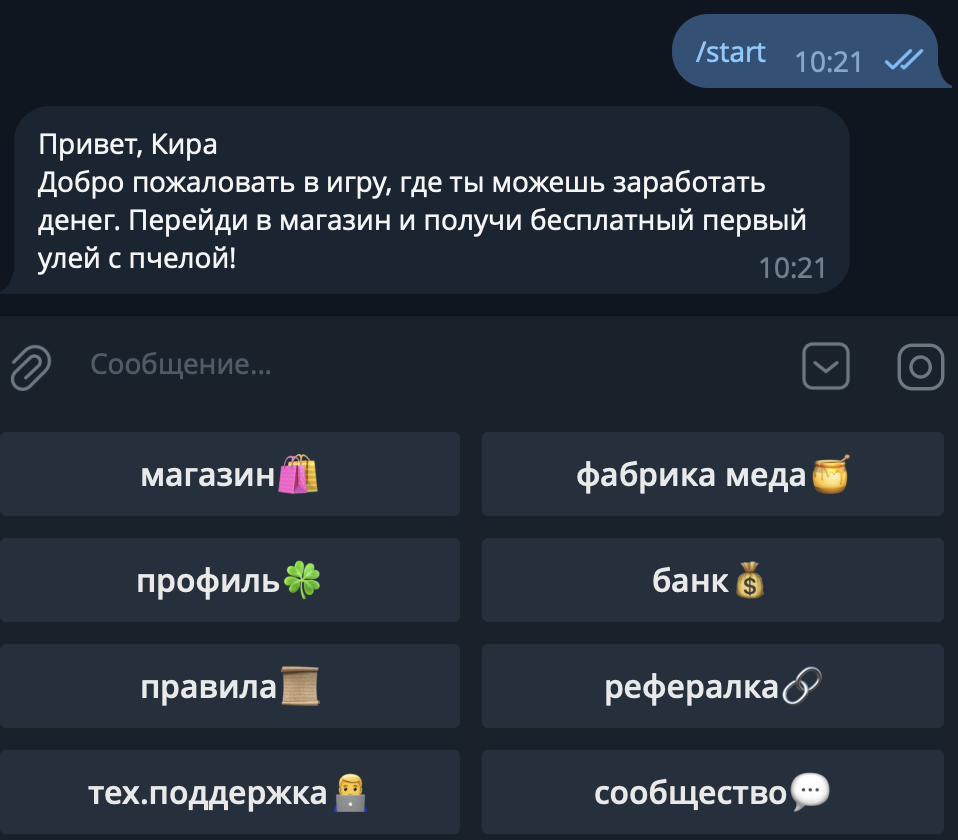
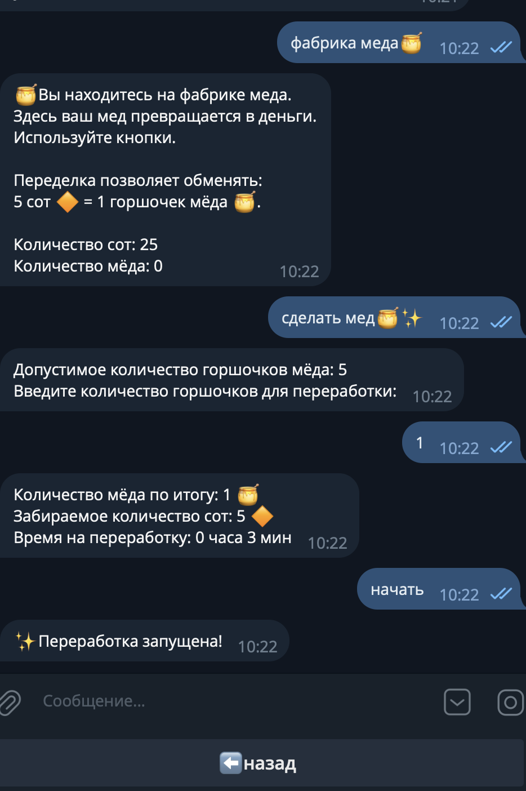
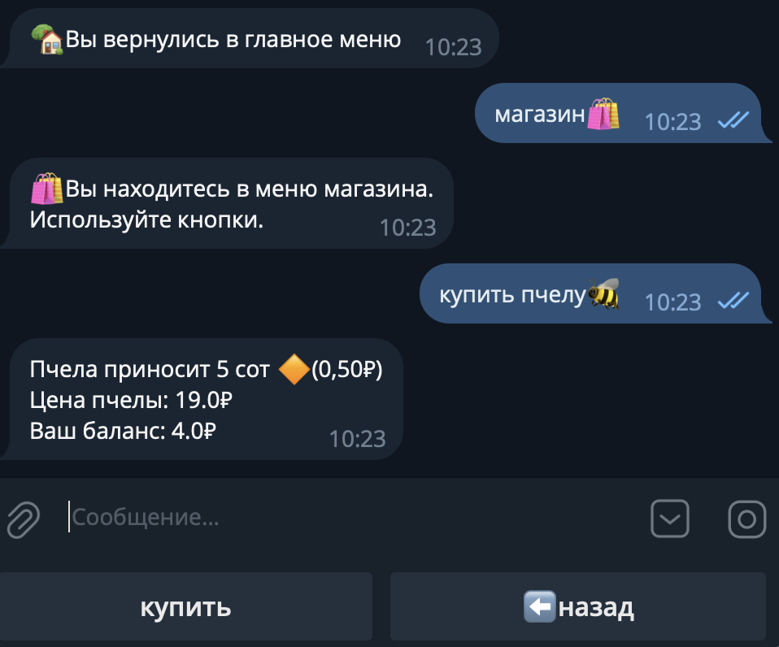
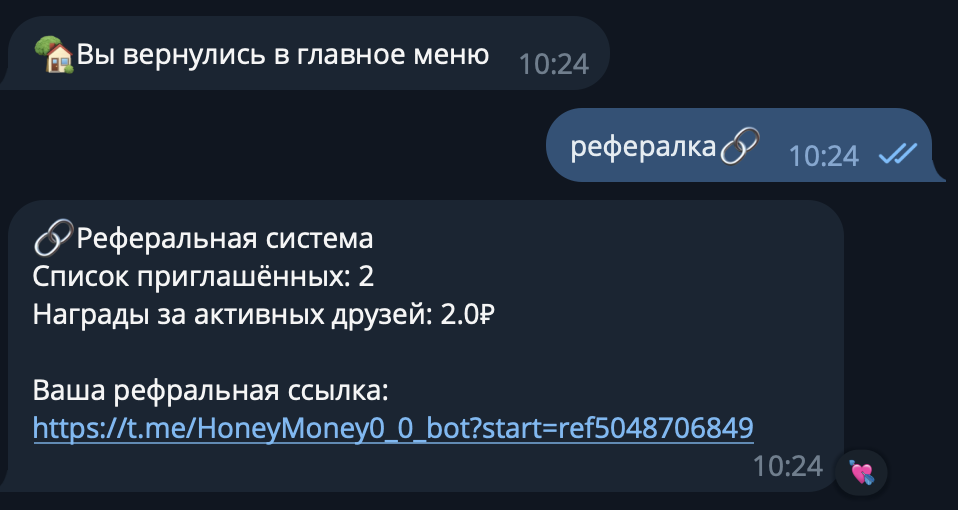
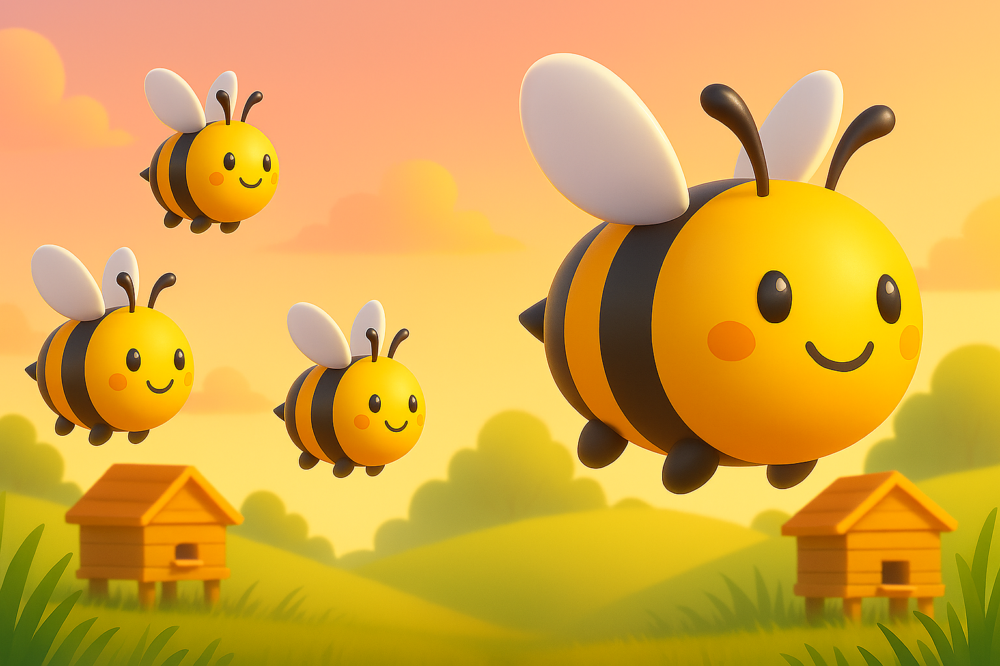

<p align="center">
  
</p>
<p align="center">
  
</p>

---

# 🐝 HoneyMoney

**HoneyMoney** — Telegram‑бот‑игра с лёгкой экономической системой, реферальной программой и автоматическими фоновыми процессами.

## ✨ Основные возможности

- Покупка и улучшение ульев и пчёл
- Производство ресурсов (соты → мёд)
- Продажа ресурсов и управление балансом
- Ежедневные награды и события
- Система кормления пчёл
- Реферальная система
- Автоматические фоновые процессы

---

## 📸 Скриншоты

### 🐝 Главное меню

Игрок начинает с простого интерфейса, где доступны основные действия: покупка, сбор, кормление.

<p align="center">
  
</p>

---

### 🍯 Производство и продажа мёда

После сбора сот игрок может переработать их в мёд и продать, чтобы пополнить баланс.

<p align="center">
  
</p>

---

### 🛒 Магазин

В магазине игрок покупает ульи, пчёл и улучшения.  
Каждый предмет влияет на скорость производства и развитие пасеки.

<p align="center">
  
</p>

---

### 🤝 Реферальная система

Игрок получает уникальную ссылку, по которой может приглашать друзей.  
За каждого приглашённого — бонусы, ускоряющие развитие.

<p align="center">
  
</p>

---

## 🚀 Запуск

```bash
pip install -r requirements.txt
python main.py
```

<p align="center">

</p>
<p align="center">

</p>
